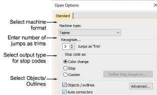
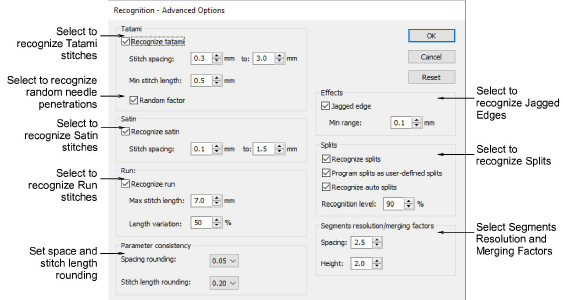

# Open options

The Open Options dialog lets you set decoding options to determine how to recognize (convert) a machine file upon opening.

## Recognition - advanced options

The Recognition - Advanced Options dialog lets you set specific values to control how EmbroideryStudio recognizes (converts) machine files.

## Related topics

- [Advanced recognition settings](../../Production/convert/Advanced_recognition_settings)
- [Reassigning colors to machine files](../../Production/convert/Reassigning_colors_to_machine_files)
