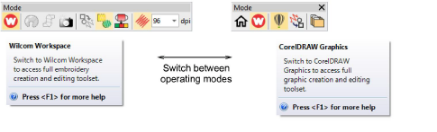

# Operating modes

|                            | Click Mode > Home to return to the Home screen to get started with a new design, or access tutorials and other product information.                      |
| ------------------------------------------------------ | -------------------------------------------------------------------------------------------------------------------------------------------------------- |
|        | Use Mode > Wilcom Workspace to digitize and edit embroidery designs. Display embroidery as well as artwork. View designs realistically in 3D simulation. |
|  | Use Mode > CorelDRAW Graphics to import, edit or create vector artwork as a backdrop for embroidery digitizing, manual or automatic.                     |
|          | Click Mode > Design Library to open a window from which to search and manage designs and job orders.                                                     |

Open EmbroideryStudio using the desktop icon or the MS Windows® Start menu. The application has one workspace or ‘design window’ but you interact with it in different operating modes. These can be accessed via the Modes toolbar.

The main modes you’ll be accessing are:

- Home: With this mode you can return to the Home screen to access new designs, or access tutorials and other product information.
- Wilcom Workspace: This mode allows you to create and edit [embroidery objects](../../glossary/glossary#embroidery-objects) using an embroidery digitizing toolset.
- CorelDRAW Graphics: This mode allows you to create and edit [vector objects](../../glossary/glossary) using the CorelDRAW® Graphics Suite toolset.
- Design Library: This mode allows you to manage designs and order jobs.

Warning: You need to calibrate your monitor so that designs at 1:1 scale appear at real size. Do this when you first install EmbroideryStudio or whenever you change your monitor. [See Calibrating the monitor for details.](../../Setup/hardware/Calibrating_the_monitor)

## Related video

<iframe src="https://www.youtube.com/embed/q1zVNto4nVw" frameborder="0" 
		 allow="accelerometer; autoplay; encrypted-media; gyroscope; picture-in-picture" 
		 allowfullscreen="" style="width: 560px; height: 315px;">

</iframe>

## Related video

<iframe src="https://www.youtube.com/embed/Yr2UTwcKr8Y" frameborder="0" 
		 allow="accelerometer; autoplay; encrypted-media; gyroscope; picture-in-picture" 
		 allowfullscreen="" style="width: 560px; height: 315px;">

</iframe>

## Related video

<iframe src="https://www.youtube.com/embed/AFnOJrW505g" frameborder="0" 
		 allow="accelerometer; autoplay; encrypted-media; gyroscope; picture-in-picture" 
		 allowfullscreen="" style="width: 560px; height: 315px;">

</iframe>

## Related topics

- [Operating modes](../../Basics/basics/Operating_modes)
- [Home screen](../../Basics/basics/Home_screen)
- [Wilcom Workspace window](../../Basics/basics/Wilcom_Workspace_window)
- [CorelDRAW Graphics window](../../Basics/basics/CorelDRAW_Graphics_window)
- [Design library](../../Basics/basics/Design_library)
- [Open designs](../../Basics/basics/Open_designs)
- [Create designs from templates](../../Basics/basics/Create_designs_from_templates)
