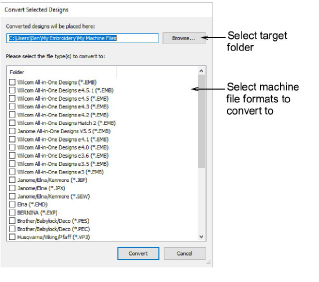

# Output designs

|    | Use Manage Designs > Convert Selected Designs to convert the design selected in the embroidery library into different machine file types. |
| ------------------------------------------------------------------ | ----------------------------------------------------------------------------------------------------------------------------------------- |
|  | Use Manage Designs > Send to Connection Manager to stitch out the design selected in the Embroidery Library.                              |

By default EmbroideryStudio saves designs to its native EMB format. This contains all information necessary both for stitching a design and for later modification. The Design Library conversion function allows you to batch-convert to and from all EMB and other supported design file types. It also batch-converts many machine file formats such as DST, EXP, SEW.

The software supports various machine models. Some can be connected by cable directly to your PC via the USB port. Older-style machines do not support direct connection but they do read ATA PC cards and/or USB memory sticks.

## Related topics

- [Machine Files](../../Production/convert/Machine_Files)
- [Converting designs](../../Management/manage_designs/Converting_designs)
- [Sending designs to machine](../../Management/manage_designs/Sending_designs_to_machine)
