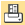
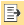
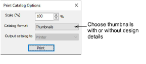

# Print designs

|                    | Use Manage Designs > Print Selected to print designs selected in the embroidery library.                                                               |
| ---------------------------------------------------------------- | ------------------------------------------------------------------------------------------------------------------------------------------------------ |
|  | Use Manage Designs > Print Selected to Catalog to print selected designs to a catalog.                                                                 |
|              | Use Manage Designs > Export Design List to export selected files to Tab and CSV (Comma Separated Value) formats suitable for use by most spreadsheets. |

The Print Selected tool lets you print worksheets for selected designs and include thumbnails of each in the worksheet. Unlike Print Designs, this option can provide design and sewing information. The Print Selected to Catalog tool allows you to print catalogs of designs with thumbnails and limited text details.

The Export Design List option can be used to print design lists for selected folders. This option allows you to create a simple design report which can easily be imported into a spreadsheet. You may want to use this in order to manage designs by file name.

## Related topics

- [Print selected designs](../../Management/manage_designs/Print_selected_designs)
- [Print design catalogs](../../Management/manage_designs/Print_design_catalogs)
- [Export design lists](../../Management/manage_designs/Export_design_lists)
