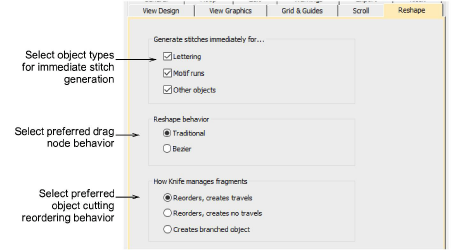

# Reshape options

Stitch generation during reshaping operations can slow down your system. Reshape options let you choose whether stitches are generated immediately or only after Enter is pressed. This tab also controls node dragging behavior in Reshape operations as well as resequencing behavior in cutting operations with the Knife tool.

## Related topics

- [Reshape options](../../Setup/settings/Reshape_options)
