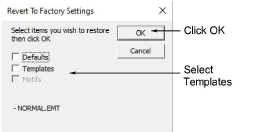

# Revert to factory settings

If you modify the NORMAL [template](../../glossary/glossary) supplied with EmbroideryStudio, you can revert to the original version. A factory copy is always maintained so that the NORMAL template can be restored.

## Related topics

- [Revert to the NORMAL template](../../Digitizing/properties/Revert_to_the_NORMAL_template)
