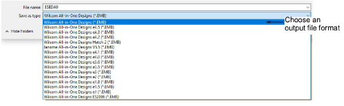

# Save design files

|  | Use Standard > Save Design to save the current design. Right-click to open the Save As dialog. |
| ---------------------------------------- | ---------------------------------------------------------------------------------------------- |

The Save options allow you to save a design to native EMB format or similar 'all-in-one' format such as JAN. To save designs to other formats, choose File > Save As. EmbroideryStudio lets you save designs in various native EMB formats. This can be important if your suppliers or clients use previous versions of Wilcom software.

Warning: If a design feature is not available in the file type you select, it will be converted – e.g. Flexi Split stitching may be changed to plain tatami.

## Related topics

- [Save & close designs](../../Basics/basics/Save_close_designs)
- [Create design templates](../../Digitizing/properties/Create_design_templates)
- [Opening machine files](../../Production/convert/Opening_machine_files)
- [Exporting designs for machine](../../Production/output/Exporting_designs_for_machine)
- [Automatic save & backup options](../../Setup/settings/Automatic_save_backup_options)
