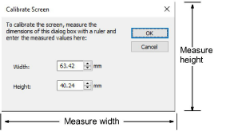

# Screen calibration

The Calibrate Screen dialog lets you calibrate your monitor to ensure that designs at 1:1 scale display at the actual size of the final embroidery.

## Related topics

- [Calibrating the monitor](../../Setup/hardware/Calibrating_the_monitor)
