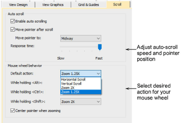

# Scrolling options

The Options > Scrolling tab allows you to control the behavior of both mouse and mouse wheel within EmbroideryStudio. Use Auto Scroll to scroll automatically within the design window while digitizing. This can be more convenient than using panning or scroll bars, especially when working on large designs. The dialog also allows you to set four different mouse wheel behaviors. That is, you can program the wheel to scroll horizontally, vertically, or zoom by preset factors.

## Related topics

- [Scroll options](../../Setup/settings/Scroll_options)
