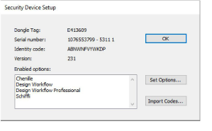
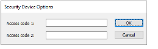

# Security device

The options in EmbroideryStudio are controlled by a security device installed in the computer, and security access codes entered in the software. Each security device has a unique serial number and identity code, so your system can be automatically recognized. New options can be added, or products upgraded, by changing the security device settings. The following dialogs all apply to the security options in EmbroideryStudio.

The Security Device Setup dialog displays the security codes that activate your software and included options. The Security Device Options dialog lets you enter access codes.

