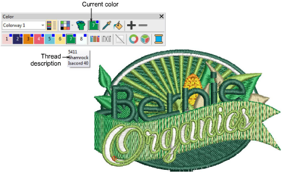

# Select thread colors

|                    | Use Color > Pick Color to pick up a color from an existing object and make it current.               |
| -------------------------------------------------------- | ---------------------------------------------------------------------------------------------------- |
|              | Use Color > Current Color to view current color.                                                     |
|    | Use Color > Apply Current Color to apply the currently selected palette color to embroidery objects. |
|                      | Use Color > Add Color to add a color to the end of the color palette.                                |
|                | Use Color > Remove Color to remove an unused color from the end of the color palette.                |
|      | Use Color > Hide Unused Colors to show or hide all unused colors in the color palette.               |
|  | Use Color > Remove Unused Colors to remove all unused colors from the color palette.                 |

The [color palette ](../../glossary/glossary)contains a selection of colors tailored to each design or color scheme. New objects are created using the currently selected color. You can change colors at any stage. [Machine functions](../../glossary/glossary) are automatically inserted in the stitching sequence whenever you assign a color.

## Related topics

- [Select thread colors](../../Basics/threads/Select_thread_colors)
