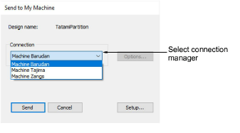
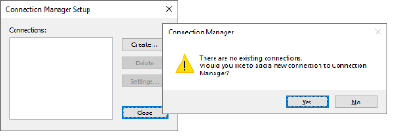
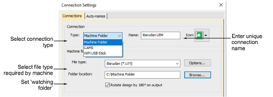

# Send designs to Connection Manager

|  | Use Standard > Send to Connection Manager to connect to supported machines via proprietary machine software. |
| ------------------------------------------------------------------ | ------------------------------------------------------------------------------------------------------------ |

Some newer machines are supplied with propriety connection software – e.g. Janome MB-4 and Barudan LEM. EmbroideryStudio supports connection to these machines via the Send to Connection Manager option. To integrate with EmbroideryStudio, the relevant software needs to be installed on the same machine. Discuss with your machine supplier for details.

## Connection Manager setup

Connection Manager provides a method of connection to machines that appear as removable media or make use of third-party connection software. These machines may require files to be placed in a specific network location or ‘watching folder’. Once set up in EmbroideryStudio, a single click is sufficient to send the design to machine.

## Connection settings

Connection Manager provides a method of connection to machines that appear as removable media or make use of third-party connection software. These machines may require files to be placed in a specific network location or ‘watching folder’. Once set up in EmbroideryStudio, a single click is sufficient to send the design to machine.

## Related topics

- [Send designs to Connection Manager](../../Production/output/Send_designs_to_Connection_Manager)
- [Exporting designs for machine](../../Production/output/Exporting_designs_for_machine)
- [Setting up machines for Connection Manager](../../Setup/hardware/Setting_up_machines_for_Connection_Manager)
