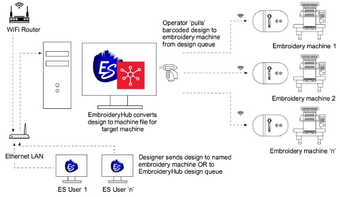

# Send designs to EmbroideryConnect

|  | Use Standard > Send to EmbroideryConnect to send the current design to a named EmbroideryConnect device.                                  |
| ------------------------------------------------------------------ | ----------------------------------------------------------------------------------------------------------------------------------------- |
|                          | Use Standard > Queue Design to send the current design to the EmbroideryConnect design queue where they can be ‘pulled’ from the machine. |

Once you have set up one or more EmbroideryConnect devices on your network, you have the choice of ‘pushing’ designs or ‘pulling’ them from the EmbroideryHub. The new Send to EmbroideryConnect tool allows you to send a design to a named EC device. Alternatively, use the Queue Design to ‘push’ them to a queue where they can be ‘pulled’ from the machine itself.

## Related video

<iframe src="https://www.youtube.com/embed/ylAvyBK4gic" frameborder="0" 
		 allow="accelerometer; autoplay; encrypted-media; gyroscope; picture-in-picture" 
		 allowfullscreen="" style="width: 560px; height: 315px;">

&#160;

</iframe>

## Related video

<iframe src="https://www.youtube.com/embed/ivtMkzwxb2g" frameborder="0" 
		 allow="accelerometer; autoplay; encrypted-media; gyroscope; picture-in-picture" 
		 allowfullscreen="" style="width: 560px; height: 315px;">

&#160;

</iframe>

## Related topics

- [Sending designs to EmbroideryConnect](../../Production/network/Sending_designs_to_EmbroideryConnect)
