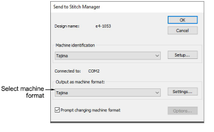
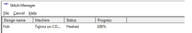

# Send designs to Stitch Manager

|  | Use Legacy Features > Send to Stitch Manager to send a design to any supported embroidery machine without changing the original design format. |
| ---------------------------------------------------------- | ---------------------------------------------------------------------------------------------------------------------------------------------- |

You can send designs directly to connected embroidery machines for stitching with Send to Stitch Manager. When you send several designs in a row, they are automatically queued and stitched out one at a time.

The Stitch Manager dialog lists all files to be stitched out. To delete a design from the queue, select it and click Cancel.

## Related topics

- [Output teamname designs](../../Lettering/lettering_names/Output_teamname_designs)
- [Send designs to Stitch Manager](../../Production/output/Send_designs_to_Stitch_Manager)
