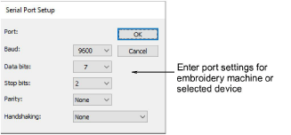

# Serial port setup

When you set up a digitizer or machine that is connected via a serial port, you need to enter the serial port settings in the Serial Port Setup dialog as part of the setup procedure.

## Related topics

- [Serial ports](../../Setup/hardware/Peripheral_device_connections)
