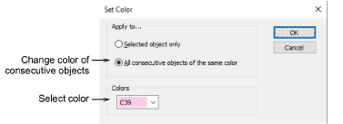

# Set color

The Set Color dialog lets you change the color of consecutive objects of the same color.

## Related topics

- [Recoloring consecutive objects](../../Basics/threads/Recoloring_consecutive_objects)
