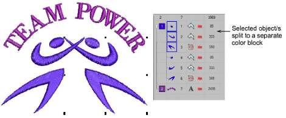

# Split color blocks

|  | Use Color > Split Palette Color to create a new color slot with the same thread specification as the selected slot. |
| ------------------------------------------------------ | ------------------------------------------------------------------------------------------------------------------- |

A [color block](../../glossary/glossary) corresponds to a color [stop](../../glossary/glossary) in the design. It may comprise a single object or group of like-color objects – e.g. ‘ropes and birds’. In one [colorway](../../glossary/glossary) you may want to assign the same thread to all items in the color block, while in another you may want to assign different colors. The Split Palette Color tool makes this possible.

## Related video

<iframe src="https://www.youtube.com/embed/bVPVANsfYik" frameborder="0" 
		 allow="accelerometer; autoplay; encrypted-media; gyroscope; picture-in-picture" 
		 allowfullscreen="" style="width: 560px; height: 315px;">

&#160;

</iframe>

## Related topics

- [Split color blocks](../../Digitizing/colorways/Split_color_blocks)
- [Viewing color blocks](....\Basics\view\Viewing_color_blocks)
