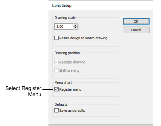

# Tablet setup

The Tablet Setup dialog lets you register the menu chart and enlargement drawing on the digitizer tablet so that EmbroideryStudio can interpret the commands you select, and the proportions and position of digitized outlines.

## Related topics

- [Register enlargement drawings](../../Setup/hardware/Register_enlargement_drawings)
- [Change drawing scales](../../Setup/hardware/Change_drawing_scales)
- [Shift enlargement drawings](../../Setup/hardware/Shift_enlargement_drawings)
