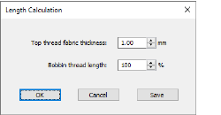

# Thread length calculation

The Length Calculation dialog lets you revise the total thread length required according to target fabric thickness.

## Related topics

- [Thread usage estimates](../../Basics/threads/Thread_usage_estimates)
