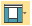
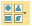
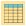
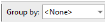
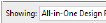
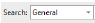
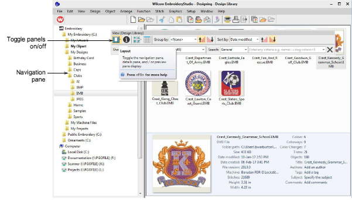

# View designs in network folders

|                        | Click View > Layout to toggle the navigation pane, details pane, and/or preview pane display.                     |
| ------------------------------------------------------ | ----------------------------------------------------------------------------------------------------------------- |
|                | Use View > Change View to select thumbnails only, thumbnails with stitching details, or summary information only. |
|  | Use View > Reset Detail Columns to reset the columns displayed in details view to the default layout.             |
|                      | Use View > Group By to group the current list of designs by the selected property.                                |
|        | Use View > Ascending Order to group designs in ascending order.                                                   |
|      | Use View > Descending Order to group designs in descending order.                                                 |
|                      | Use View > Showing to filter the current list of designs by file type.                                            |
|                        | Use View > Sort By to sort the current list of designs by the selected property.                                  |
|                        | Use View > Search to filter designs based on the given search criteria.                                           |

Navigating to design folders with Design Library is similar to browsing with File Explorer. Your access to design folders on your network is only limited by access rights determined by your [System Administrator](../../glossary/glossary). View any supported file type residing in design folders. Designs can be searched, sorted, grouped, and browsed by customer or order.

## Related video

<iframe src="https://www.youtube.com/embed/FDZ50HBWeic" frameborder="0" 
		 allow="accelerometer; autoplay; encrypted-media; gyroscope; picture-in-picture" 
		 allowfullscreen="" style="width: 560px; height: 315px;">

</iframe>

## Related topics

- [Viewing designs in network folders](../../Management/manage_designs/Viewing_designs_in_network_folders)
