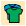
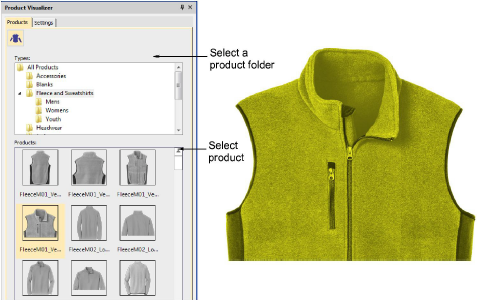

# Visualize products

|  | Use Color > Product Visualizer to choose a garment or product backdrop on which to position your decoration. |
| ------------------------------------------------------ | ------------------------------------------------------------------------------------------------------------ |
|              | Click View > Show Product to toggle product image on/off. Right-click to open the Product Visualizer docker. |
|          | Use Zoom > Zoom to Product to view the entire product in the design window.                                  |

EmbroideryStudio lets you choose a garment or product backdrop on which to position your decoration. Use it to display location, size and overall appearance for visualization and approval purposes. These can be included on approval or production sheets.

## Related video

<iframe src="https://www.youtube.com/embed/YUsK9ZRO0FA" frameborder="0" 
		 allow="accelerometer; autoplay; encrypted-media; gyroscope; picture-in-picture" 
		 allowfullscreen="" style="width: 560px; height: 315px;">

</iframe>

## Related topics

- [Change backgrounds](../../Basics/view/Change_backgrounds)
- [Set fabric backgrounds](../../Digitizing/colorways/Set_fabric_backgrounds)
- [Visualize products](../../Digitizing/colorways/Visualize_products)
- [Printing design reports](../../Production/reports/Printing_design_reports)
