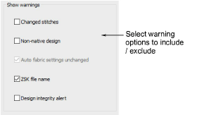

# Warning options

Some warning messages may become distracting. You may want to switch such warnings off but still be able to re-activate them at a later time. The Options dialog includes a Warnings tab which allows you to re- or de-activate specific warning messages as desired.

## Related topics

- [Warning options](../../Setup/settings/Warning_options)
