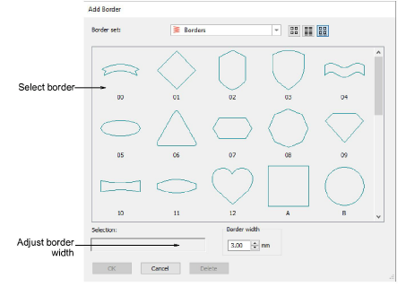

# Add design borders

|  | Use Toolbox > Add Border to add borders to designs (or selected objects) with or without lettering. |
| -------------------------------------- | --------------------------------------------------------------------------------------------------- |

Add attractive borders such as rectangles, ovals, and shields to designs using the Borders symbol set.

## Related topics

- [Add design borders](../../Modifying/productivity/Add_design_borders)
