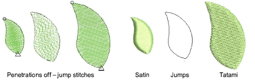

# Add jumps with penetrations off

|  | Deselect Function > Penetrations to create jumps with needles or borers out. |
| -------------------------------------------- | ---------------------------------------------------------------------------- |

You can create jump [connectors](../../glossary/glossary) manually in a design by digitizing with penetrations off. The Penetrations tool prevents the needle from penetrating the fabric, forcing the machine to move across the design in a series of jumps. You can use Penetrations with any input method.

## Related topics

- [Add jumps with penetrations off](../../Quality/connectors/Add_jumps_with_penetrations_off)
- [Boring](../../Applied/mixed/Boring)
