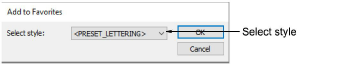
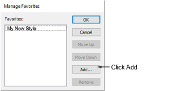

# Add to favorites

Styles you tag as ‘favorites’ are each assigned an icon on the toolbar. Styles are stored with the design [template](../../glossary/glossary). The NORMAL template provides a selection of preset styles for you to use. Each template may contain specific styles for different types of embroidery. The Add To Favorites dialog lets you assign up to ten favorite styles to tool icons on the Styles toolbar.

## Manage favorites

The Manage Favorites dialog lets you assign up to ten favorite styles to tool icons on the Styles toolbar.

## Related topics

- [Working with styles](../../Digitizing/properties/Working_with_styles)
- [Assign favorites](../../Digitizing/properties/Assign_favorites)
