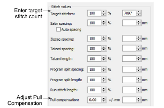

# Adjust stitch densities

|  | Use Stitch > Process Stitches to adjust stitch density of and/or scale the whole or selected parts of a design. |
| -------------------------------------------------- | --------------------------------------------------------------------------------------------------------------- |

You may need to change stitch density in order to stitch on a different fabric or with a different thread. Or you may want to make production cheaper by reducing the overall stitch count. The Process Stitches feature lets you change the density of all stitch types (except [manual](../../glossary/glossary) stitch) across the whole or selected parts of a design. It also lets you adjust the density of selected stitch types. You can even use the feature to [scale](../../glossary/glossary) a design.

## Related topics

- [Adjusting stitch densities](../../Quality/quality/Adjusting_stitch_densities)
- [Process manual stitches](../../Modifying/functions/Process_manual_stitches)
