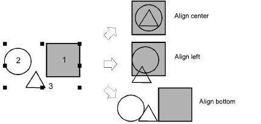

# Align objects

|                                | Use Arrange > Align Left to left-align selected objects.                                         |
| -------------------------------------------------------------------- | ------------------------------------------------------------------------------------------------ |
|      | Use Arrange > Align Centers Vertically to align centers of selected objects down the screen.     |
|                              | Use Arrange > Align Right to right-align selected objects.                                       |
|                                  | Use Arrange > Align Top to top-align selected objects.                                           |
|  | Use Arrange > Align Centers Horizontally to align centers of selected objects across the screen. |
|                            | Use Arrange > Align Bottom to bottom-align selected objects.                                     |
|                          | Use Arrange > Align Centers to align selected objects through their centers.                     |

You can align selected design objects to the left, right, top, bottom or center of a specific object. The Arrange tools offers a set of buttons to trigger functions of the same name found in the Arrange menu.

Note: Objects are aligned with the last object selected. When all the objects in the design are selected by using Ctrl+A or a selection marquee they are aligned with the last object in the sequence.

## Related topics

- [Align objects](../../Modifying/transform/Align_objects)
