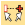
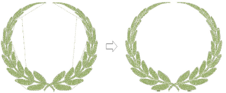

# Apply automatic branching

|  | Click Arrange > Branching to automatically sequence and group like embroidery objects. |
| -------------------------------------- | -------------------------------------------------------------------------------------- |

The Branching feature lets you digitize like objects – e.g. the fingers of a hand, sections of a custom letter – without having to think about the most efficient stitching sequence and joins. Branching is designed for use with shapes made up of objects that overlap – e.g. complicated letters, Asian characters, etc. Apply Branching to join selected objects to form a single ‘branched object’. Objects are resequenced, [connectors](../../glossary/glossary#connectors) minimized, component objects grouped, and stitches regenerated. All component objects are grouped and selectable as one.

## Related video

<iframe src="https://www.youtube.com/embed/2ek4VnHmifo" frameborder="0" 
		 allow="accelerometer; autoplay; encrypted-media; gyroscope; picture-in-picture" 
		 allowfullscreen="" style="width: 560px; height: 315px;">

</iframe>

## Related topics

- [Automatic branching](../../Quality/connectors/Automatic_branching)
