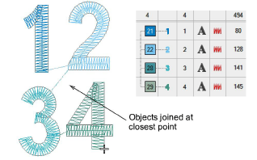

# Apply closest join

|  | Use Arrange > Apply Closest Join to (re-)apply closest join to objects after editing. |
| ---------------------------------------------------- | ------------------------------------------------------------------------------------- |

When you are digitizing closed objects, the Closest Join method automatically calculates the closest join between them, saving you having to think about entry and exit points. The Apply Closest Join feature allows you to (re-)apply closest join to objects after editing. The command may be accessed via:

- Toolbar button on the Arrange toolbar
- Arrange menu
- Design Window popup menu
- Color-Object List popup menu
- Shortcut key (J)

## Related video

<iframe src="https://www.youtube.com/embed/S4dvCkt3JgU" frameborder="0" 
		 allow="accelerometer; autoplay; encrypted-media; gyroscope; picture-in-picture" 
		 allowfullscreen="" style="width: 560px; height: 315px;">

</iframe>

## Related topics

- [Minimizing connectors](../../Quality/connectors/Minimizing_connectors)
- [Other general options](../../Setup/settings/Other_general_options)
