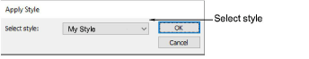

# Apply styles

|  | Use Styles > Apply Style to apply a style from the template to new or selected objects. |
| ---------------------------------------- | --------------------------------------------------------------------------------------- |
|          | Use Styles > Favorite Styles to apply preferred styles to new or selected objects.      |

A style is a group of property settings stored under a unique name. This makes it easy to apply them to selected embroidery and lettering objects. Use the Styles toolbar to apply styles to selected objects. When you apply a [style](../../glossary/glossary), the settings overwrite [current settings](../../glossary/glossary). Any properties not specified in the style, retain their current settings.

## Related video

<iframe src="https://www.youtube.com/embed/WvgldwMdCUw" frameborder="0" 
		 allow="accelerometer; autoplay; encrypted-media; gyroscope; picture-in-picture" 
		 allowfullscreen="" style="width: 560px; height: 315px;">

&#160;

</iframe>

## Related topics

- [Working with styles](../../Digitizing/properties/Working_with_styles)
- [Apply styles](../../Digitizing/properties/Apply_styles)
