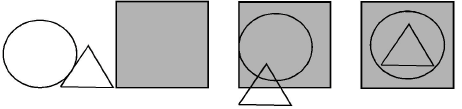

# Arrange tools

The Arrange toolbar contains tools for moving, aligning and distributing objects, including grouping and locking tools.

## Related video

<iframe src="https://www.youtube.com/embed/-X3KnhQXi_E" frameborder="0" 
		 allow="accelerometer; autoplay; encrypted-media; gyroscope; picture-in-picture" 
		 allowfullscreen="" style="width: 560px; height: 315px;">

&#160;

</iframe>

## Related topics

- [Group & lock objects](Group_lock_objects)
- [Align objects](Align_objects)
- [Distribute objects](Distribute_objects)
- [Make objects same size](Make_objects_same_size)
