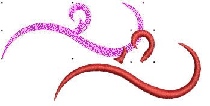

# Break apart composite objects

|  | Use Edit > Break Apart to split composite objects – monograms, appliqués, lettering, etc – into component objects. |
| ---------------------------------------- | ------------------------------------------------------------------------------------------------------------------ |

The Break Apart tool allows you to break up composite objects – monograms, appliqués, lettering, etc. The effect on these objects is similar to ungrouping.

## Related topics

- [Break apart composite objects](../../Modifying/reshape/Break_apart_composite_objects)
