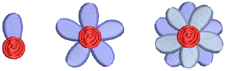

# Copy & paste objects

|      | Click Standard > Cut to remove selected objects to the clipboard. |
| ------------------------------ | ----------------------------------------------------------------- |
|    | Click Standard > Copy to copy selected objects to the clipboard.  |
|  | Click Standard > Paste to paste copied objects to a design.       |

You can copy objects to create multiple, identical objects, or to insert objects from other designs. Cut-and-paste action changes the [stitching sequence](../../glossary/glossary) in the design.

## Related topics

- [Copy & paste objects](../../Modifying/combine/Copy_paste_objects)
- [Sequence by cut-and-paste](../../Modifying/combine/Sequence_by_cut-and-paste)
