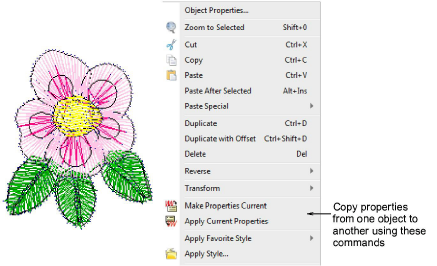

# Copy properties

|    | Click Styles > Make Properties Current to make the properties of a selected object current for the design. |
| ---------------------------------------------------------------- | ---------------------------------------------------------------------------------------------------------- |
|  | Use Styles > Apply Current Properties to apply current settings to selected objects.                       |

You can make a selected object’s ‘actual’ properties ‘[current](../../glossary/glossary)’ for all new objects or apply them to existing objects.

## Related topics

- [Copy properties](../../Digitizing/properties/Copy_properties)
