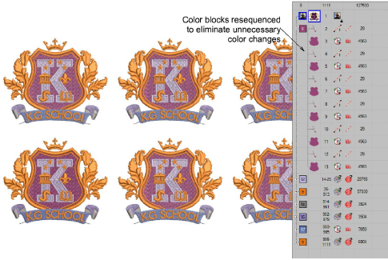

# Create design arrays

|  | Use Mirror Merge > Array to duplicate designs, such as badges, re-sequencing color blocks for efficient multiple design stitchouts. |
| ------------------------------ | ----------------------------------------------------------------------------------------------------------------------------------- |

Use the Mirror-Merge Array tool to create multiple copies of designs, such as badges, spaced in rows and columns for faster stitchout. Mirror-Merge automatically sequences each color block to eliminate unnecessary machine color changes.

## Related topics

- [Creating design arrays](../../Modifying/productivity/Creating_design_arrays)
