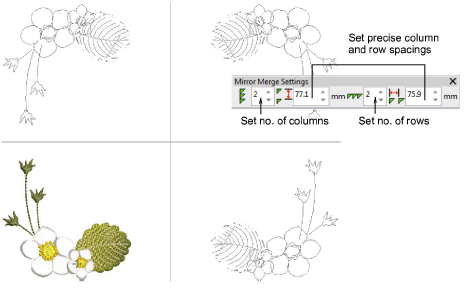

# Create multiple reflections

|              | Use Mirror Merge > Reflect to duplicate and mirror objects or designs. |
| ---------------------------------------------- | ---------------------------------------------------------------------- |
|                    | Use Mirror-Merge > Rows to set no. of rows.                            |
|        | Use Mirror-Merge > Row Spacing to set precise row spacing.             |
|              | Use Mirror-Merge > Columns to set number of columns.                   |
|  | Use Mirror-Merge > Column Spacing to set precise column spacing.       |

Use the Mirror Merge Reflect tool to duplicate and mirror designs simultaneously. Set any number of rows or columns. The feature is often used in making fashion or textile designs. The limit for allowable wreath points is 100.

## Related video

<iframe src="https://www.youtube.com/embed/bnus8J1z4Ec" frameborder="0" 
		 allow="accelerometer; autoplay; encrypted-media; gyroscope; picture-in-picture" 
		 allowfullscreen="" style="width: 560px; height: 315px;">

</iframe>

## Related topics

- [Create multiple reflections](../../Modifying/productivity/Create_multiple_reflections)
