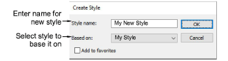
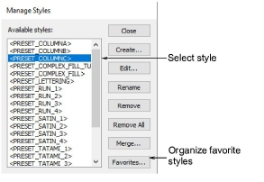

# Create styles

The Create Style dialog lets you define new styles for a template, either from scratch, or based on an existing style or object.

## Manage styles

The Manage Styles dialog lets you create a new style, merge with another style, assign a style as favorite, apply styles to objects, modify existing styles and delete obsolete styles.

## Related topics

- [Working with styles](../../Digitizing/properties/Working_with_styles)
- [Define styles](../../Digitizing/properties/Define_styles)
- [Modify styles](../../Digitizing/properties/Modify_styles)
