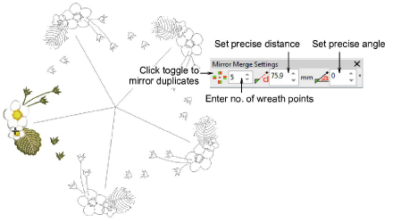

# Create wreaths

|              | Use Mirror Merge > Wreath to duplicate objects around a center point.                  |
| -------------------------------------------- | -------------------------------------------------------------------------------------- |
|  | Use Mirror Merge > Kaleidoscope to duplicate and mirror objects around a center point. |
|  | Use Mirror-Merge > Wreath Points to enter number of wreath points.                     |
|          | Use Mirror-Merge > Distance to set precise distance.                                   |
|                | Use Mirror-Merge > Angle to set precise angle.                                         |

Use the Mirror Merge Wreath tool to duplicate objects around a center point. The Kaleidoscope tool works like Wreath but mirrors the selection as well.

## Related topics

- [Create wreaths](../../Modifying/productivity/Create_wreaths)
