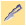
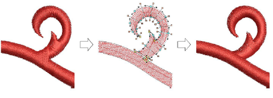

# Cut shapes

|                    | Use Edit > Knife to cut objects along a digitized line, preserving stitch settings and colors in resulting objects.                                                                 |
| ------------------------------------------------ | ----------------------------------------------------------------------------------------------------------------------------------------------------------------------------------- |
|  | Use Edit > Automatic Knife to automatically slice Complex Fill and Complex Turning embroidery objects into smaller turning stitch and single angle objects with automatic overlaps. |

The Knife tool is used to manually cut filled shapes into smaller fragments. It has the advantage over Split Object and Divide tools of allowing you to digitize temporary cut lines. The tool cuts both filled and ‘fillable’ vector objects as well as embroidery objects.

The Automatic Knife tool assists semi-automated digitizing of vector artwork. When objects have clean boundaries, EmbroideryStudio fragments them automatically and generates good quality stitching in most cases. It also operates on Complex Fill and Complex Turning embroidery objects.

## Related topics

- [Cut shapes manually](../../Modifying/reshape/Cut_shapes_manually)
- [Cut shapes automatically](../../Modifying/reshape/Cut_shapes_automatically)
