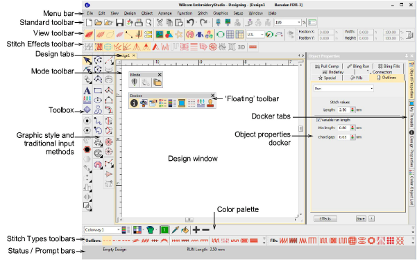

# Design Editing

You can access commands using buttons on the toolbars of your design window. To use a tool, simply move the mouse pointer over it, and click with the left mouse button.

## Related topics

- [Object Properties](Object_Properties)
- [Styles](Styles)
- [View designs](View_designs)
- [Selection tools](Selection_tools)
- [Editing tools](Editing_tools)
- [Sequence tools](Sequence_tools)
- [Transformation tools](Transformation_tools)
- [Arrange tools](Arrange_tools)
- [Mirror-merge tools](Mirror-merge_tools)
- [Shaping tools](Shaping_tools)
- [Envelope tools](Envelope_tools)
- [Generated outlines & fills](Generated_outlines_fills)
- [Connectors](Connectors)
- [Stitch editing](Stitch_editing)
- [Machine functions](Machine_functions)
- [Finalize designs](Finalize_designs)
