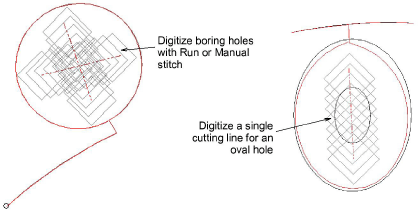

# Digitize boring holes

|  | Use Function > Borers to activate the boring function. |
| -------------------------------- | ------------------------------------------------------ |

If your embroidery machine is equipped with a boring knife or needle, you can use the Borers tool to cut holes in the fabric, producing an effect similar to lace. With Borers selected, each needle penetration point becomes a borer hole, regardless of the selected stitch type. Borer holes are generally stabilized with Zigzag to prevent fraying and movement, and bordered with Satin stitches.

## Related video

<iframe src="https://www.youtube.com/embed/ln4-d1xSchs" frameborder="0" 
		 allow="accelerometer; autoplay; clipboard-write; encrypted-media; gyroscope; picture-in-picture" 
		 allowfullscreen="" style="width: 560px; height: 315px;">

&#160;

</iframe>

## Related topics

- [Boring](../../Applied/mixed/Boring)
