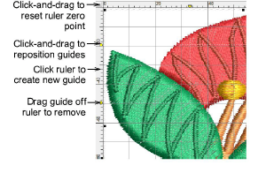

# Display grids, rulers & guides

|                        | Click View > Show Grid to show or hide the grid. Right-click for settings.                       |
| ---------------------------------------------------------- | ------------------------------------------------------------------------------------------------ |
|  | Click View > Show Rulers and Guides to show or hide rulers and guides. Right-click for settings. |
|            | Drag the Ruler Zero Point to reset a new ruler zero point.                                       |

EmbroideryStudio provides a set of grid lines to help accurately align or size [embroidery objects](../../glossary/glossary#embroidery-objects).

Use grid lines to help accurately align or size [embroidery objects](../../glossary/glossary#embroidery-objects). Default grid spacing is 10mm x 10mm. Invoke rulers to accurately position and scale objects. The unit of measurement – mm or inches – defaults to the regional settings in the MS Windows® Control Panel.

## Related topics

- [Display grids, rulers & guides](../../Basics/basics/Display_grids_rulers_guides)
- [Grid display options](../../Setup/settings/Grid_display_options1)
- [Ruler & guide display options](../../Setup/settings/Ruler_guide_display_options)
