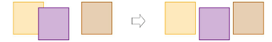

# Distribute objects

|  | Use Arrange > Space Evenly Across to distribute selected objects evenly across the screen. |
| ------------------------------------------------------ | ------------------------------------------------------------------------------------------ |
|      | Use Arrange > Space Evenly Down to distribute selected objects evenly down the screen.     |

You can automatically distribute selected objects with even spacing between them, both vertically or horizontally. The Arrange tools offers a set of buttons to trigger functions of the same name found in the Arrange menu.

::: info Note
The tools all become enabled when three or more objects are selected.
:::

## Related topics

- [Distribute objects evenly](../../Modifying/transform/Distribute_objects_evenly)
