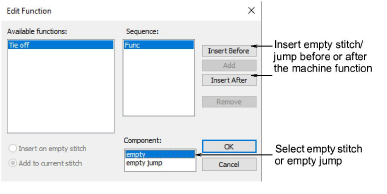

# Edit machine functions manually

|  | Use Docker > Stitch List to toggle Stitch List display on/off. Use it to edit machine function encoding and to clear machine functions. |
| -------------------------------------------------- | --------------------------------------------------------------------------------------------------------------------------------------- |
|      | Click Function > Clear Function to remove machine functions at current stitch cursor position.                                          |
|        | Click Function > Edit Function to edit machine function at current stitch cursor position.                                              |
|            | Click Function > Insert Stop to insert stop function at current stitch cursor position.                                                 |

You can edit the encoding of machine functions by changing the number or sequence of [empty stitches](../../glossary/glossary) or [empty jumps](../../glossary/glossary) that appear around them. Some machines require a specific number of empty stitches or empty jumps in combination with a function in order to interpret it correctly. You may need to edit functions if they were inserted incorrectly or the machine format has changed.

## Edit functions

The Edit Function dialog lets you edit functions to include empty stitches or jumps around them.

## Clear functions

Use the Clear Function dialog to selectively clear functions as required.

## Related topics

- [Edit machine functions manually](../../Modifying/functions/Edit_machine_functions_manually)
