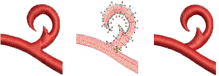

# Editing tools

The Edit tools contains tools for object editing operations, including manual and automatic cutting.

## Related video

<iframe src="https://www.youtube.com/embed/lM820ENY6PI" frameborder="0" 
		 allow="accelerometer; autoplay; encrypted-media; gyroscope; picture-in-picture" 
		 allowfullscreen="" style="width: 560px; height: 315px;">

&#160;

</iframe>

## Related video

<iframe src="https://www.youtube.com/embed/j5-IPsbaQjg" frameborder="0" 
		 allow="accelerometer; autoplay; encrypted-media; gyroscope; picture-in-picture" 
		 allowfullscreen="" style="width: 560px; height: 315px;">

&#160;

</iframe>

## Related topics

- [Copy & paste objects](Copy_paste_objects)
- [Undo & redo functions](Undo_redo_functions)
- [Break apart composite objects](Break_apart_composite_objects)
- [Cut shapes](Cut_shapes)
- [Stitch angle tools](Stitch_angle_tools)
- [Reshape tools](Reshape_tools)
