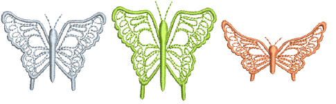

# Envelope tools

|            | Apply Envelope > Bridge Envelope to make objects bulge or arch.      |
| ---------------------------------------------------------- | -------------------------------------------------------------------- |
|            | Apply Envelope > Penant Envelope to make objects compress.           |
|  | Apply Envelope > Perspective Envelope to make objects stretch.       |
|          | Apply Envelope > Diamond Envelope to make objects bulge or compress. |

Four types of Envelope effect are available – Bridge, Pennant, Perspective and Diamond. Envelopes are typically applied to lettering objects, but they can also be applied to other types of embroidery object.

## Related topics

- [Applying envelopes](../../Modifying/reshape/Applying_envelopes)
