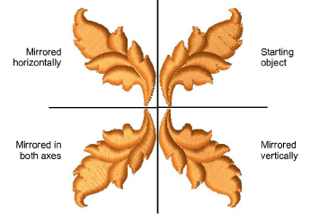

# Flip objects horizontally & vertically

|  | Click Transform > Mirror Horizontal to flip selected objects in the horizontal plane. |
| ---------------------------------- | ------------------------------------------------------------------------------------- |
|  | Click Transform > Mirror Vertical to flip selected objects in the vertical plane.     |

You can mirror selected objects horizontally or vertically using the Mirror tools. Select objects to mirror and click a Mirror icon. For productivity, shortcut keys are available for mirror operations.

## Related topics

- [Flip objects horizontally & vertically](../../Modifying/transform/Flip_objects_horizontally_vertically)
