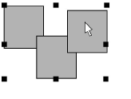

# Group & lock objects

|          | Click Arrange > Group to group selected objects.                     |
| -------------------------------------- | -------------------------------------------------------------------- |
|      | Click Arrange > Ungroup to ungroup selected objects.                 |
|            | Click Arrange > Lock to lock selected objects.                       |
|  | Click Arrange > Unlock All to unlock all locked objects in a design. |

Group objects, or an entire design, to keep them together for moving, [scaling](../../glossary/glossary#scaling) and transforming actions. With grouped objects you can also apply global changes, saving time and ensuring consistency. When you have finished making changes to a group, you can ungroup and work with the component objects.

Lock objects to prevent them from being moved or modified by accident. For example, locking [backdrop](../../glossary/glossary#backdrop) images holds them in place as you digitize, transform or reshape the embroidery objects near them.

## Related topics

- [Group & ungroup objects](../../Modifying/combine/Group_ungroup_objects)
- [Lock & unlock objects](../../Modifying/combine/Lock_unlock_objects)
