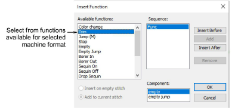

# Insert machine functions manually

|  | Click Function > Insert Function to insert machine function at current stitch cursor position. |
| ------------------------------------------------ | ---------------------------------------------------------------------------------------------- |

You can insert machine functions manually by means of the Insert Function dialog. Depending on your machine’s requirements, you will either add the function to the current stitch, or insert it on an [empty stitch](../../glossary/glossary) or [empty jump](../../glossary/glossary). For some machines you will also need to add empty stitches or empty jumps on either side of some functions. See your machine manual for details. The Insert Function dialog lets you insert machine functions in your design manually.

Warning: When you insert machine functions manually, you must maintain them manually. For this reason, only insert manual functions if they cannot be added automatically.

## Related topics

- [Insert machine functions manually](../../Modifying/functions/Insert_machine_functions_manually)
- [Insert sequin drops](../../Applied/sequin_advanced/Insert_sequin_drops)
