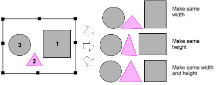

# Make objects same size

|                    | Click Arrange > Make Same Width to scale an object or design to the same width as a reference object.           |
| ---------------------------------------------------------------- | --------------------------------------------------------------------------------------------------------------- |
|                  | Click Arrange > Make Same Height to scale an object or design to the same height as a reference object.         |
|  | Click Arrange > Make Same Width and Height to scale an object or design to the same size as a reference object. |

You can scale objects to the same size as a reference object. Resize the height or width separately or both.

Note: Objects are resized with reference to the last object selected. If all objects are selected by using Ctrl+A or a selection marquee, they are resized with reference to the last object in the sequence.

## Related topics

- [Make objects the same size](../../Modifying/transform/Make_objects_the_same_size)
